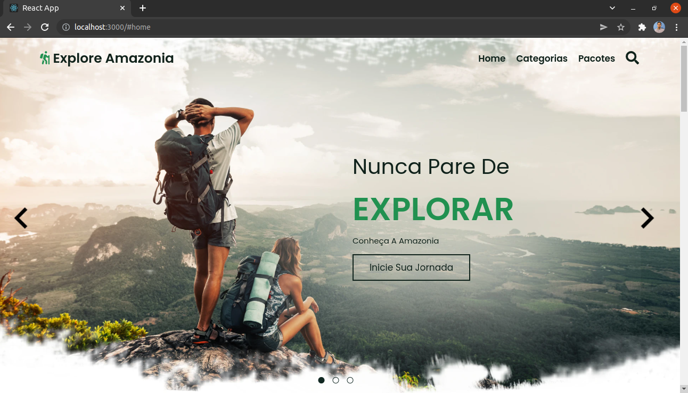
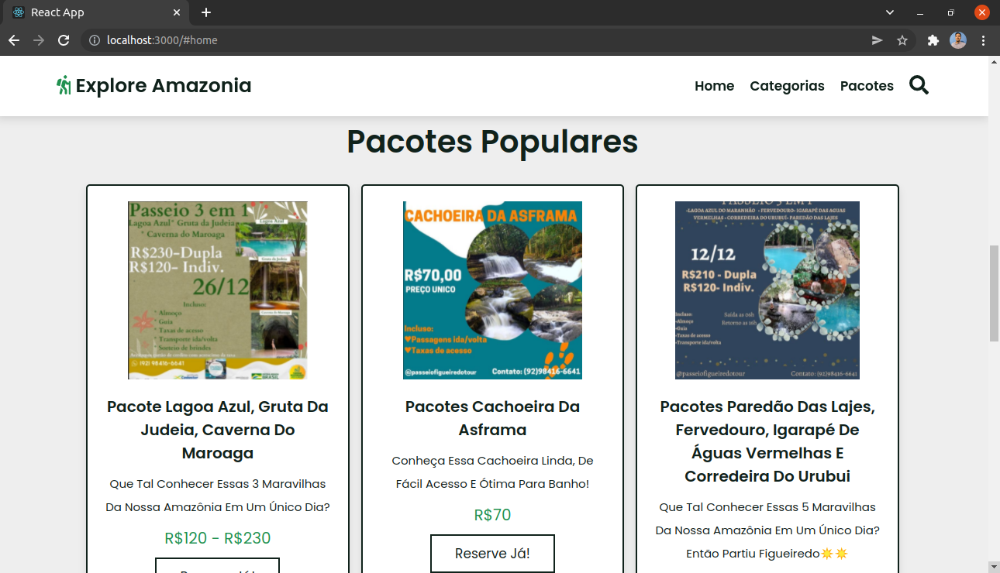
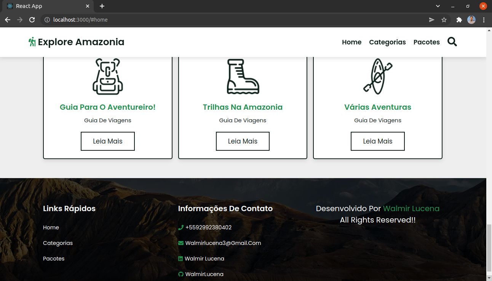

# Explore Amazonia Website

Esse projeto consiste num Website de Aventura na Amazônia, onde apresento algumas opções de turismo para quem não conhece a região. A aplicação Web foi contruída de forma responsiva as telas utilizando React, Context API, Sass. 

# Habilidades

Neste projeto, é necessário as seguintes habilidades para a sua execução:

  - Utilizar a Context API do _React_ para gerenciar estado
  - Utilizar o _React Hook useState_
  - Utilizar o _React Hook useContext_
  - Utilizar o _React Hook useEffect_
  - Utilizar o _Sass_ para reutilização de código
  - Utilizar o _Font Awesome_ para o uso de ícones
  - Utilizar o _Swiper_ para transições aceleradas por hardware

# Dependências

Antes do desenvolvimento precisa ser instalado:

### `npm install`

### `npm install node-sass`

Node-sass é uma biblioteca que fornece ligação para Node.js para LibSass , a versão C do pré-processador de folha de estilo popular, Sass.

Ele permite que você compile nativamente arquivos .scss para css em uma velocidade incrível e automaticamente através de um middleware de conexão.

### `npm i --save @fortawesome/fontawesome-svg-core`

Biblioteca de ícones e kit de ferramentas necessários. Utilizado em ícones presentes no projeto.

### `npm install --save @fortawesome/free-solid-svg-icons`

### `npm install --save @fortawesome/react-fontawesome`

### `npm install --save @fortawesome/free-brands-svg-icons`

Se você quiser usar estilos de ícones adicionais, você precisará instalar os três comandos acima também.

### `npm i swiper`

O Swiper permite o controle deslizante de toque moderno, usado tanto em dispositivos moveis e aplicativos Web.

## Home Section

A página foi dividida em seções, a primeira é a home section, nela está contida o Header e os slides deslizantes (tanto pelo botão quando pelo touch de telas).

## Category Section

[Category Section](src/images/capture2.png "Category Section")

## Packages Section

## Services Section and Footer

